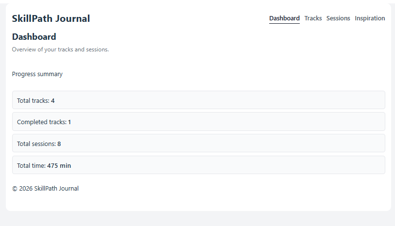
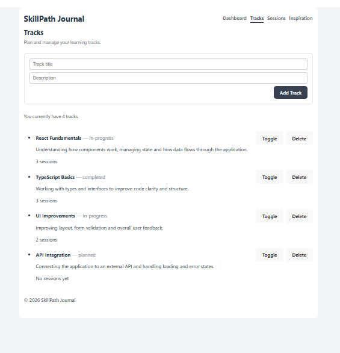
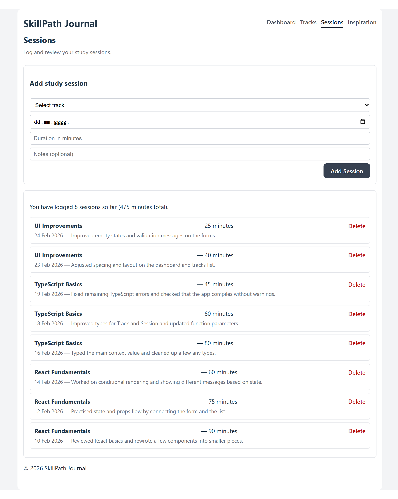

# SkillPath Journal

SkillPath Journal is a web application for organizing learning tracks and logging study sessions.  
It helps track progress, total study time, and keeps data stored locally in the browser.

Live Demo: https://study-track-manager.netlify.app

## Application Preview

### Dashboard

### Tracks Page

### Sessions Page

## Features

- Create and manage learning tracks  
- Update track status (in progress / completed)  
- Log study sessions with date, duration, and notes  
- View total sessions and total study time  
- Store data using localStorage  
- Load short inspirational messages from an external API  

## Tech Stack

- React  
- TypeScript  
- React Router  
- Context API  
- localStorage  
- Vite  

## Getting Started

npm install
npm run dev